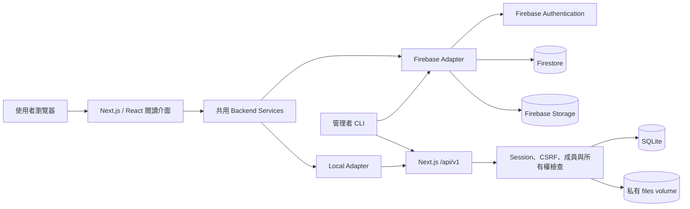

# Cross-Platform Reader

Cross-Platform Reader 是一個**私人、邀請制的線上圖書館**。部署者可以讓核准的成員登入，管理自己的 PDF 與 ePub，並在瀏覽器閱讀。每位成員的書籍、閱讀進度、書籤、畫線、閱讀設定與資料匯出都彼此隔離。

本專案提供兩種後端：

- **Docker local**：適合單台 VPS、家用伺服器或 NAS，使用 SQLite 與本機持久化檔案，不需要 Firebase 帳號。
- **Firebase**：使用部署者自己的 Firebase Authentication、Firestore、Storage 與 App Hosting。適合希望使用代管服務的人。

這不是公開書籍目錄，也不會自動把你現有的 Firebase 專案或書庫搬進來。使用者下載到瀏覽器的離線副本，無法由伺服器事後撤回。

## 功能

- PDF 與 ePub 閱讀器
- 文字搜尋、目錄、閱讀進度與閱讀設定
- 書籤、畫線與個人筆記資料
- 書籍與封面上傳、刪除及資料匯出
- 登入、登出、核准／停用成員與密碼重設
- Docker 模式的 SQLite 與檔案備份／還原
- Firebase 與 Docker 共用同一套閱讀介面與資料介面
- 成員驗證、每位使用者的所有權檢查、CSRF 防護與私有檔案快取

## 系統架構



前端只依賴共用的 `AuthService`、`LibraryRepository`、`ReaderDataRepository` 與 `FileStore`。`READER_BACKEND=firebase` 或 `READER_BACKEND=local` 決定實際資料來源；Docker 模式的伺服器會從工作階段取得使用者身分，不信任請求自行提供的 UID。

## 用 Docker 啟動自己的圖書館

需要 Docker Desktop（Linux containers／WSL 2）或已安裝 Docker Engine 與 Compose。請在乾淨 clone 的專案根目錄執行：

### Windows PowerShell

```powershell
cd reader-app
Copy-Item .env.example .env
# 編輯 .env，至少把 SESSION_SECRET 換成長且隨機的值
docker compose up -d --build
"請在這裡放一個長密碼" | docker compose exec -T reader npm run local:user -- create you@example.com --password-stdin
```

### Linux、macOS 或 WSL

```bash
cd reader-app
cp .env.example .env
# 編輯 .env，至少把 SESSION_SECRET 換成長且隨機的值
docker compose up -d --build
printf '%s' '請在這裡放一個長密碼' | docker compose exec -T reader npm run local:user -- create you@example.com --password-stdin
```

開啟 <http://localhost:3000> 後，以剛建立的帳號登入即可。預設連接埠只綁定 `127.0.0.1`。要公開給網路使用，請設定自己的網域、HTTPS 與防火牆，並參考內建的 Caddy 設定；不要直接把開發用 HTTP 連接埠暴露到網際網路。

管理者指令都在 `reader-app/` 執行：

```bash
# 列出成員、核准或停用成員
npm run local:user -- list
npm run local:user -- enable you@example.com
npm run local:user -- disable you@example.com

# 重設密碼；密碼從隱藏提示或標準輸入讀取
npm run local:user -- reset-password you@example.com --password-stdin
```

完整的環境變數、HTTPS、備份與還原流程請看 [`docs/DEPLOYMENT.md`](docs/DEPLOYMENT.md)。SQLite 與 `files/` 必須放在持久化 volume；此版本預期只有一個應用程式實例使用同一個 SQLite 檔案。

## 使用 Firebase 部署

請建立你自己的 Firebase 專案，啟用 Email/Password 或 Google Authentication，建立 Firestore、Storage 與 Web App，然後把 [`reader-app/.env.example`](reader-app/.env.example) 中的值填入部署環境。不要使用或提交其他人的 `.env.local`、服務帳號金鑰、資料庫、書籍或備份。

部署者需要在自己的管理電腦安裝 Firebase CLI 與 `firebase-admin`，部署 Firestore rules、indexes、Storage rules 及 App Hosting，並使用成員管理指令核准第一位 Firebase UID：

```bash
cd reader-app
npm install -g firebase-tools
npm install --no-save firebase-admin
export GOOGLE_APPLICATION_CREDENTIALS=/private/path/service-account.json
node scripts/firebase-members.mjs approve FIREBASE_UID
```

服務帳號金鑰只可存在管理者電腦或受保護的 CI secret，不能進入瀏覽器 bundle、Docker image 或 Git。Firebase 的詳細設定、CORS、授權網域與 rules 驗證請看 [`docs/DEPLOYMENT.md`](docs/DEPLOYMENT.md)。

## 本機開發與驗證

```bash
cd reader-app
npm ci
npm run lint
npm run typecheck
npm run build
npm audit --omit=dev --audit-level=high
```

Local API smoke test：

```bash
npm run test:local-api
```

Firebase rules 測試需要 Firebase Emulator；CI 會執行 rules、local API、Docker smoke test 與 Git 歷史敏感資料掃描。請先閱讀 [`SECURITY.md`](SECURITY.md) 回報安全問題，並閱讀 [`CONTRIBUTING.md`](CONTRIBUTING.md) 了解修改與提交方式。

## 資料與安全注意事項

- `.env`、`.env.local`、服務帳號金鑰、SQLite、`files/`、備份與測試書籍不得提交到 Git。
- Docker 正式環境請使用長且隨機的 `SESSION_SECRET`、HTTPS、`COOKIE_SECURE=true`，並限制管理端 CLI 與資料 volume 的存取權。
- 每一個書籍、封面、進度、書籤、畫線與匯出請求都會依登入工作階段和擁有者檢查。
- 停用成員會拒絕新的登入與資料存取，並撤銷其現有工作階段。
- 上傳限制為單本書籍小於 100 MiB、封面小於 2 MiB；檔案 API 不接受任意外部 URL 或任意伺服器路徑。
- 備份前請停止應用程式；還原只能寫入空白 data volume。請依 [`docs/DEPLOYMENT.md`](docs/DEPLOYMENT.md) 的指令驗證備份。

## 授權

本專案採用 [MIT License](LICENSE)。第三方依賴的授權清單與安全稽核紀錄請看 [`docs/DEPENDENCY-AUDIT.md`](docs/DEPENDENCY-AUDIT.md) 與 [`docs/SECURITY-AUDIT.md`](docs/SECURITY-AUDIT.md)。
